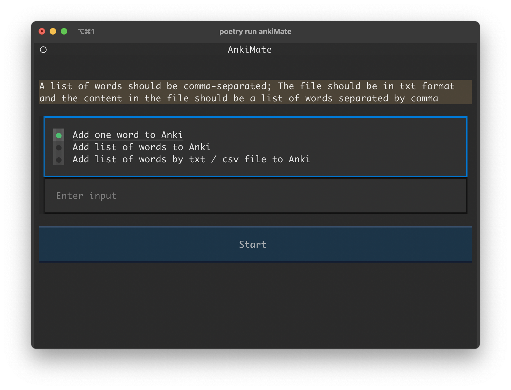
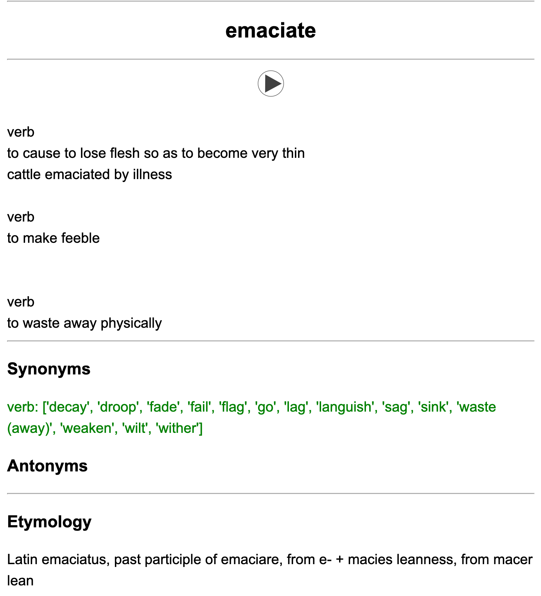

# AnkiMate
- Get English words definitions, etymology, synonyms, antonyms from Merriam Webster's Collegiate Dictionary.
- Get example / testing sentences from Wordnik
- Create a Anki Deck called EnglishVocab, import the words info to the deck.

## How to use
- Create a `.env` file with the following variables:
```
MW_DICT_KEY = xxxxxxxx-xxxx-xxxx-xxxx-xxxxxxxxxxxx
MW_THE_KEY = xxxxxxxx-xxxx-xxxx-xxxx-xxxxxxxxxxxx
WORDIK_API_KEY = xxxxxxxx-xxxx-xxxx-xxxx-xxxxxxxxxxxx
```
- run the app using `poetry run ankiMate`

## UI
- 

## Anki Card
### Learning Card


### Testing Card


